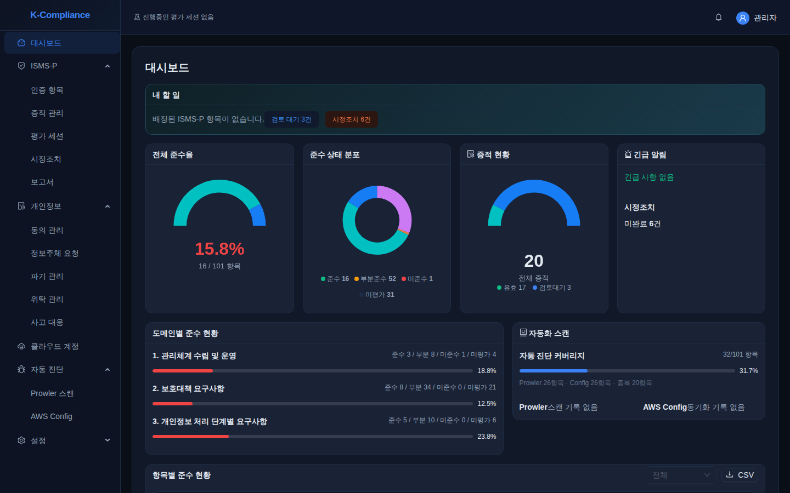
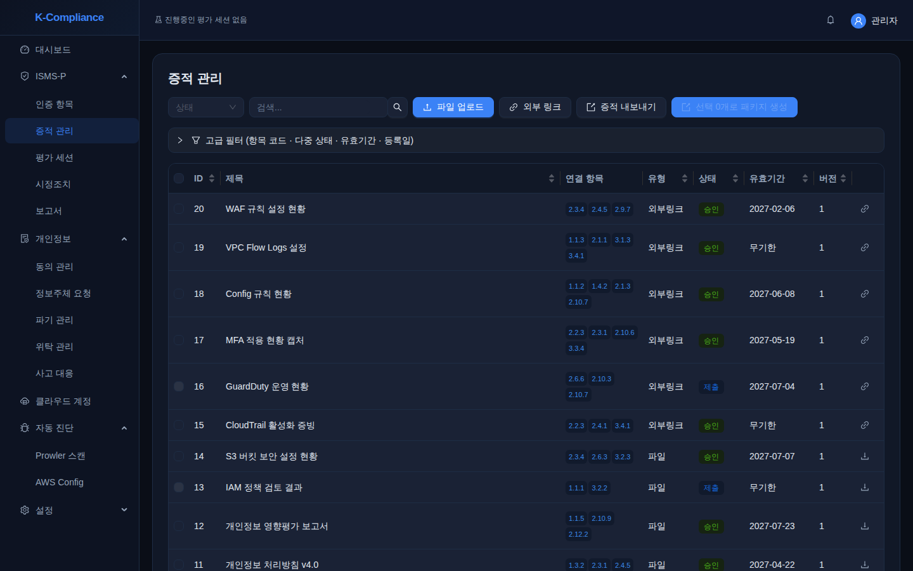
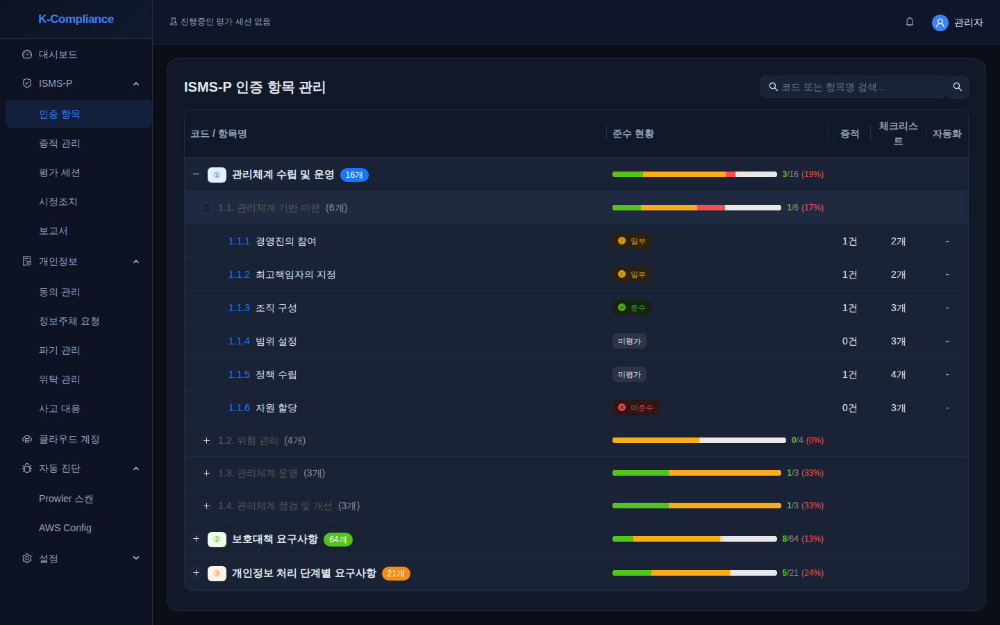
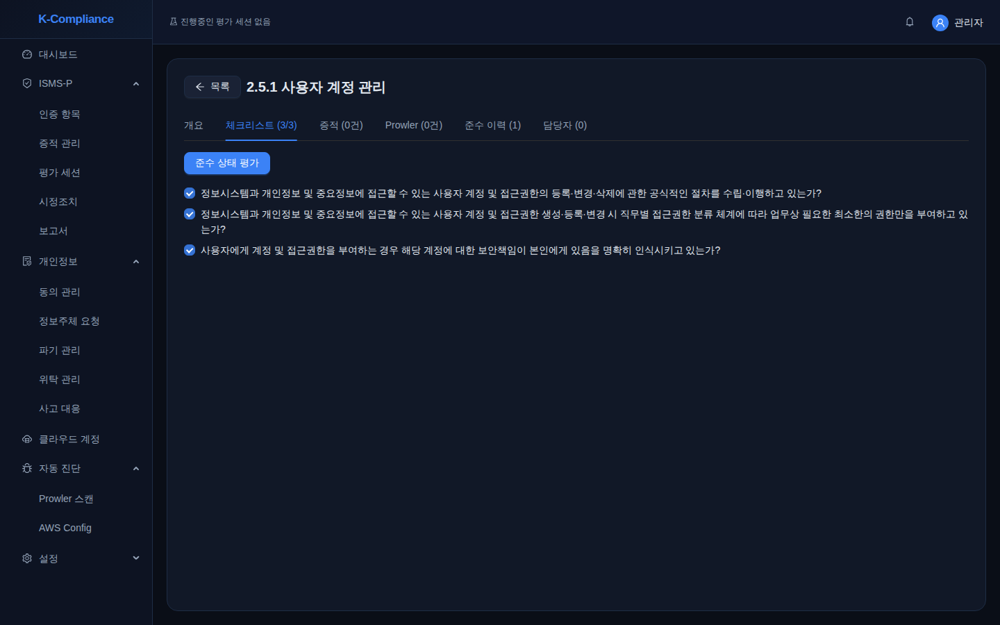
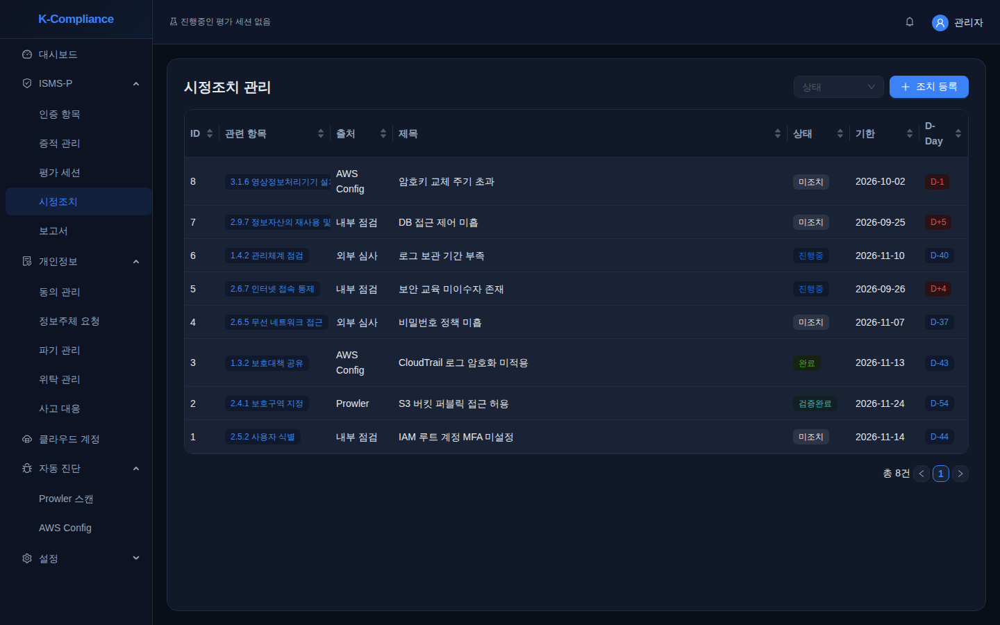
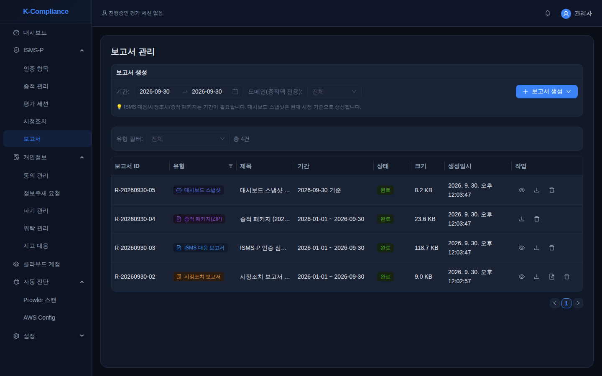

# K-Compliance

개인정보 보호법(PIPA) 운영 업무와 ISMS-P 인증심사 대응을 한곳에서 관리하는 사내용 웹 애플리케이션.



## 목표

- ISMS-P 101개 인증항목마다 증적을 모으고, 검토·승인해 항목에 연결하고, 준수 상태를 평가한다.
- PIPA 법정 기한을 놓치지 않는다. 정보주체 요청 10일, 침해사고 신고 72시간, 파기·위탁·시정조치 기한.
- Prowler·AWS Config 진단 결과를 ISMS-P 항목에 매핑해 기술적 통제의 근거로 쓴다.
- 심사 때 제출할 보고서(HTML)와 증적 패키지(ZIP)를 만든다.

## 설치와 실행 (로컬)

필요: Python 3.12, Node.js, PostgreSQL 18, libmagic

```bash
# 1. DB (macOS Homebrew 예시)
brew install postgresql@18 libmagic && brew services start postgresql@18
createuser kcompliance && createdb -O kcompliance kcompliance

# 2. 설정
cp .env.example .env && chmod 600 .env
# .env 에서 JWT_SECRET_KEY, ENCRYPTION_KEY 를 openssl rand -hex 32 값으로 바꾼다

# 3. 백엔드
cd backend
python3.12 -m venv .venv && .venv/bin/pip install -r requirements.txt
.venv/bin/python -m alembic upgrade head
.venv/bin/python -m app.seeds.load
.venv/bin/python -m app.cli create-admin <username> <email>
.venv/bin/python -m uvicorn app.main:app --reload --port 8000

# 4. 프론트엔드 (다른 터미널)
cd frontend && npm install && npm run dev
```

- 앱: http://localhost:5173 (`/api` 요청은 :8000 으로 프록시)
- API 문서: http://localhost:8000/docs
- `create-admin` 은 CPO 권한 계정을 만들고 임시 비밀번호를 출력한다. 첫 로그인 후 바꾼다.
- `app.seeds.load` 는 KISA 인증기준(2023.11)의 도메인 3, 서브도메인 21, 항목 101, 체크리스트 328개를 넣는다. 다시 실행해도 중복되지 않는다.
- `S3_BUCKET_NAME` 을 비우면 증적 파일은 `backend/uploads/` 에 저장된다.

## 사용 방법

### 1. 사용자와 역할

**설정 > 사용자 관리**에서 계정을 추가한다.

| 역할 | 할 수 있는 일 |
|---|---|
| `cpo` | 전체 권한 |
| `security_officer` | ISMS-P 관리, 증적 검토, 스캔 실행, 보고서 생성 |
| `privacy_handler` | 정보주체 요청 처리, 파기 실행, 동의 관리 |
| `auditor` | 읽기 전용, 감사 로그 조회 |

증적은 올린 사람이 직접 승인할 수 없다. 검토할 사람이 최소 한 명 더 있어야 한다.

### 2. 증적 등록과 검토



**ISMS-P > 증적 관리**

1. **파일 업로드**(50MB 이하) 또는 **외부 링크**로 증적을 등록하고 관련 항목 코드를 연결한다. 등록 직후 상태는 `작성중`.
2. 제출하면 `제출`이 된다.
3. 다른 사용자가 검토해 `승인` 또는 `반려`한다. 반려할 때는 사유를 적어야 한다.
4. 유효기간이 지나면 `만료`로 바뀐다. 새 버전을 올리면 이전 버전은 `대체`된다.

### 3. 항목별 준수 평가



**ISMS-P > 인증 항목**에서 도메인 > 서브도메인 > 항목 순으로 펼쳐 항목별 준수 상태, 증적 수, 체크리스트 수를 본다.



항목을 열고 **체크리스트** 탭에서 세부 점검항목을 체크한 뒤 **준수 상태 평가**로 `준수 / 일부 / 미준수 / 해당없음`을 기록한다. 같은 화면에서 연결된 증적, Prowler 결과, 준수 이력, 담당자를 확인한다.

심사 단위로 묶어서 평가하려면 **ISMS-P > 평가 세션**에서 세션(최초 / 사후 / 갱신)을 만들고, 화면 상단 헤더에서 그 세션을 선택한다. 선택한 동안의 평가 기록이 그 세션에 연결된다.

### 4. 시정조치



**ISMS-P > 시정조치**에서 결함을 관련 항목, 출처(내부 점검, 외부 심사, Prowler, AWS Config), 기한과 함께 등록하고 상태를 바꿔 가며 관리한다. 기한까지 남은 날이 D-Day로 표시된다.

### 5. 개인정보 업무

**개인정보** 메뉴: 동의 관리, 정보주체 요청, 파기 관리, 위탁 관리, 사고 대응.

- 기한은 자동으로 정해진다. 정보주체 요청은 접수일(KST) + 10일, 침해사고 신고는 탐지 시각 + 72시간.
- 매시 정각에 정보주체 요청, 파기, 침해사고, 위탁 계약 만료, 시정조치 기한과 증적 유효기간을 점검해 알림을 만든다.
- 기한이 지나면 정보주체 요청, 파기, 시정조치는 `기한 초과`, 증적은 `만료` 상태로 바뀐다.

### 6. 자동 진단 (AWS)

1. **클라우드 계정**에서 AWS 계정을 등록한다. 인증 방식은 `instance_role`(서버의 인스턴스 프로파일)이나 `assume_role`(Role ARN, 선택적으로 External ID) 중 하나. Role ARN과 External ID는 `ENCRYPTION_KEY`로 암호화해 저장한다.
2. **자동 진단 > Prowler 스캔**에서 스캔을 실행한다. 서버에 Prowler CLI가 설치돼 있어야 한다(`PROWLER_BIN_PATH`).
3. **자동 진단 > AWS Config**에서 K-ISMS 적합성 팩 결과를 동기화한다.

결과는 매핑된 ISMS-P 항목(각 26개)의 상세 화면에 표시된다.

### 7. 보고서



**ISMS-P > 보고서**에서 기간을 정하고 **보고서 생성**을 누른다.

| 보고서 | 형식 | 기간 |
|---|---|---|
| ISMS 대응 보고서 | HTML | 필요 |
| 시정조치 보고서 | HTML, CSV | 필요 |
| 증적 패키지 | ZIP (`MANIFEST.sha256` 포함). 도메인 필터 가능 | 필요 |
| 대시보드 스냅샷 | HTML | 생성 시점 기준 |

### 8. 감사 로그

**설정 > 감사 로그**에서 모든 쓰기 작업의 기록을 조회한다. 자기 담당 업무를 스스로 처리한 경우에는 `self_*` 플래그가 붙는다.

### 개발 환경 전용 기능

`APP_ENV=development`일 때만 **설정 > 초기화 (개발환경)** 메뉴가 동작한다. 샘플 데이터를 만들거나, 사용자 계정·시드·클라우드 계정 설정을 뺀 나머지 데이터를 지울 수 있다. 다른 값이면 403을 돌려준다. 운영 서버에서는 `development`로 두지 않는다.

## EC2 배포: 비밀값은 SSM Parameter Store에서

EC2에서는 비밀값을 `.env`에 두지 않고 SSM Parameter Store(SecureString)에서 읽는다. AWS 자격증명은 인스턴스 프로파일만 쓴다.

- `SSM_PARAMETER_PREFIX` 아래의 파라미터를 같은 이름의 설정으로 읽는다. 예: `/k-compliance/prod/JWT_SECRET_KEY` → `JWT_SECRET_KEY`
- 우선순위: 환경변수 > `.env` > SSM. 로컬과 CI에서는 비워 둔다.
- 접두사를 지정했는데 SSM 조회가 실패하면 앱이 시작되지 않는다.

**1. 파라미터 등록**

```bash
aws ssm put-parameter --region ap-northeast-2 --type SecureString \
  --name /k-compliance/prod/JWT_SECRET_KEY --value "$(openssl rand -hex 32)"
aws ssm put-parameter --region ap-northeast-2 --type SecureString \
  --name /k-compliance/prod/ENCRYPTION_KEY --value "$(openssl rand -hex 32)"
```

`DATABASE_URL`, `DATABASE_URL_SYNC`도 같은 방식으로 넣을 수 있다. `ENCRYPTION_KEY`를 바꾸면 클라우드 계정의 Role ARN과 External ID를 다시 입력해야 한다.

**2. 인스턴스 프로파일에 읽기 권한 추가**

```json
{
  "Effect": "Allow",
  "Action": "ssm:GetParametersByPath",
  "Resource": [
    "arn:aws:ssm:ap-northeast-2:<ACCOUNT_ID>:parameter/k-compliance/prod",
    "arn:aws:ssm:ap-northeast-2:<ACCOUNT_ID>:parameter/k-compliance/prod/*"
  ]
}
```

고객 관리형 KMS 키로 암호화했다면 그 키의 `kms:Decrypt` 권한도 필요하다.

**3. 실행 환경에 접두사 지정**

```ini
# systemd [Service]
Environment=SSM_PARAMETER_PREFIX=/k-compliance/prod
Environment=SSM_REGION=ap-northeast-2
```

`alembic`과 `app.cli`도 같은 설정을 읽는다. 셸에서 실행할 때는 `SSM_PARAMETER_PREFIX`를 export한 뒤 실행한다.

## 개발

```bash
# 백엔드 테스트: .env 의 DB 를 그대로 쓴다. 사용자명 admin 인 CPO 계정이 있어야 한다
cd backend && TEST_ADMIN_PASSWORD='<admin 비밀번호>' .venv/bin/python -m pytest

# 프론트엔드 타입 체크
cd frontend && npx tsc --noEmit

# 마이그레이션 추가
cd backend && .venv/bin/python -m alembic revision --autogenerate -m "<설명>"
```

구성: FastAPI, SQLAlchemy 2 (async), Alembic, APScheduler / React 18, TypeScript, Vite, Ant Design 5 / PostgreSQL / S3 / Prowler 5, AWS Config
